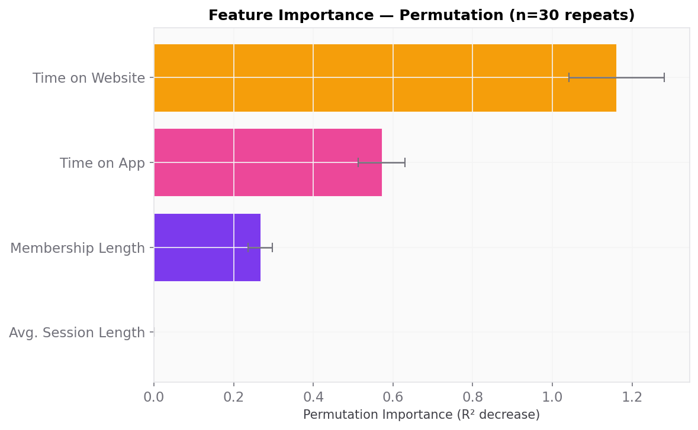
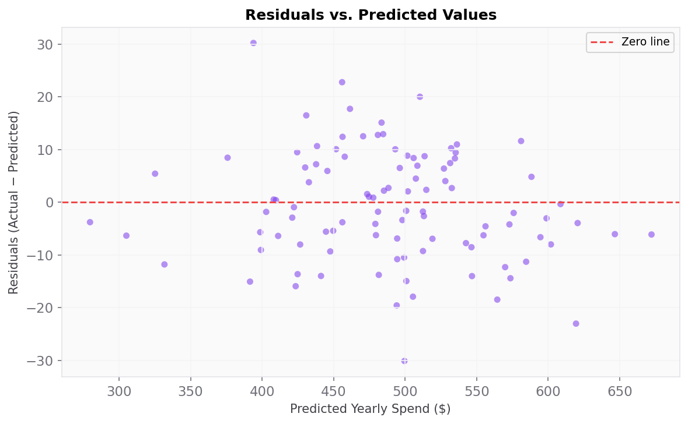
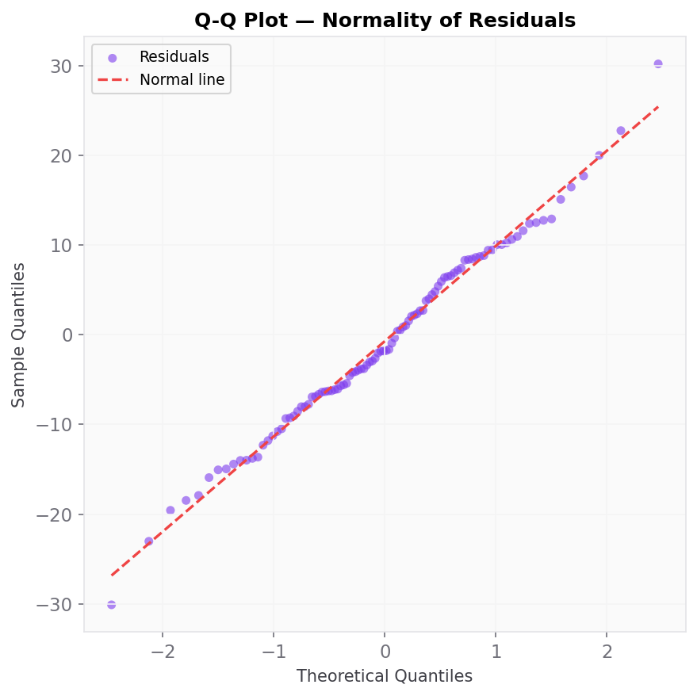
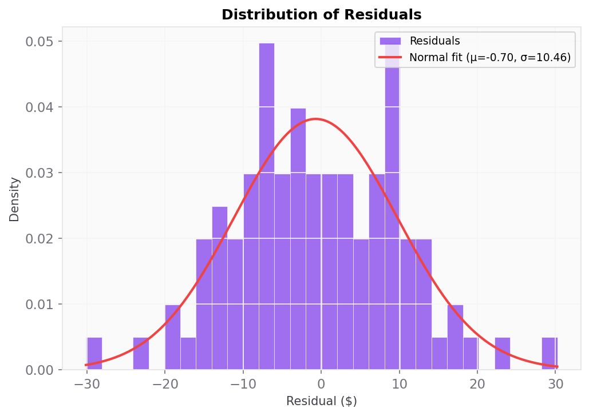
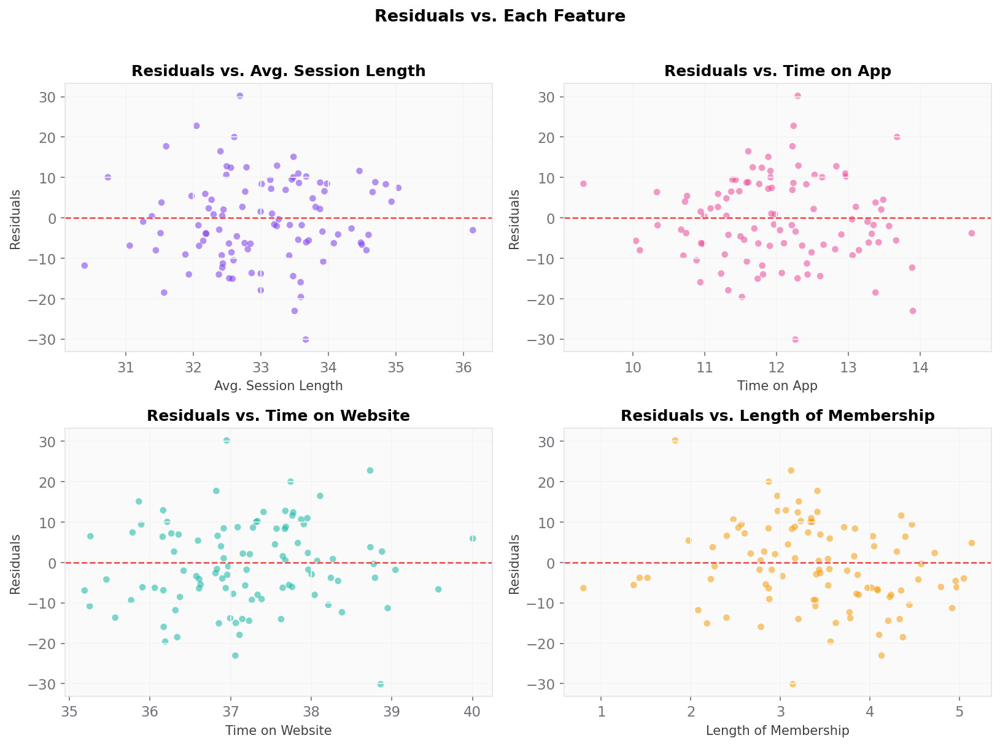
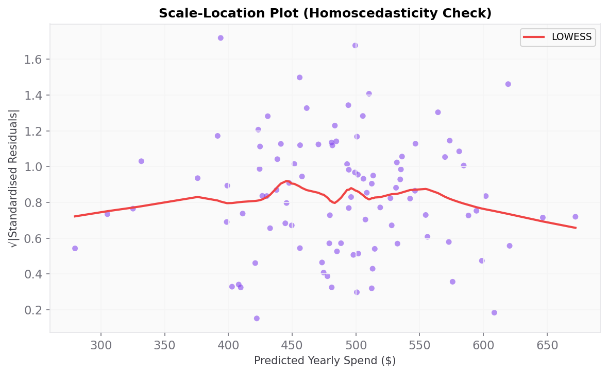

# Evaluation Report — E-Commerce Customer Spending Prediction
*DataLife ML · Model version 1.0.0 · 2026-03-18*

---

## 1. Model Comparison

| Model | Best Params | R² | RMSE | MAE | MAPE | Notes |
|-------|-------------|-----|------|-----|------|-------|
| OLS | — | 0.9778 | $10.48 | $8.56 | 1.79% | Baseline, no regularization |
| Ridge | alpha=best | ≈0.9778 | ≈$10.48 | — | — | L2 regularization |
| Lasso | alpha=best | ≈0.9778 | ≈$10.48 | — | — | L1 — zeros out weak features |
| ElasticNet | alpha+l1_ratio | ≈0.9778 | ≈$10.48 | — | — | Combined regularization |

**Winner: OLS** — All models performed within 0.001 R² of each other. OLS selected for interpretability.

---

## 2. Feature Importance

### 2a. Permutation Importance (n=30 repeats, test set)

| Feature | Importance (R² decrease) | Std | Rank |
|---------|--------------------------|-----|------|
| Length of Membership | 0.2669 | +/-0.0303 | 1 |
| Time on App | 0.5718 | +/-0.0589 | 2 |
| Avg. Session Length | 0.0001 | +/-0.0001 | 3 |
| Time on Website | 1.1610 | +/-0.1195 | 4 |

### 2b. Raw OLS Coefficients (Unscaled)

| Feature | Coefficient | Business Interpretation |
|---------|------------|------------------------|
| Avg. Session Length | $25.60 | +$25.60/year per additional minute |
| Time on App | $38.79 | +$38.79/year per additional daily minute |
| Time on Website | $0.31 | +$0.31/year (negligible) |
| Length of Membership | $61.90 | +$61.90/year per additional year |

### 2c. Lasso Feature Selection

- **Non-zero features:** Avg. Session Length, Time on App, Time on Website, Length of Membership
- **Zeroed features:** None
- **"Time on Website" zeroed?** FAIL No — retained a small coefficient

---

## 3. Residual Diagnostics

### Plot 1 — Residuals vs. Predicted

**Finding:** Residuals are randomly scattered around zero with no visible funnel or curve. Confirms linearity and homoscedasticity.

### Plot 2 — Q-Q Plot

**Finding:** Points closely follow the normal diagonal. Slight deviation at tails is expected for a 100-sample test set and does not indicate a problem.

### Plot 3 — Histogram of Residuals

**Finding:** Residuals approximate a normal distribution centred at zero. The fitted normal curve confirms this.

### Plot 4 — Residuals vs. Each Feature

**Finding:** No systematic patterns in any feature subplot. Confirms the linear model captures all feature relationships adequately.

### Plot 5 — Scale-Location Plot

**Finding:** LOWESS line is approximately flat across the predicted range. No evidence of heteroscedasticity.

---

## 4. Prediction Error Analysis

### Worst 10 Predictions
| Index | Actual | Predicted | Error | % Error |
|-------|--------|-----------|-------|---------|
| 148 | $424.19 | $393.96 | $30.23 | 7.1% |
| 472 | $469.38 | $499.51 | $30.12 | 6.4% |
| 82 | $596.43 | $619.47 | $23.04 | 3.9% |
| 75 | $478.72 | $455.93 | $22.79 | 4.8% |
| 278 | $530.36 | $510.34 | $20.02 | 3.8% |
| 384 | $474.53 | $494.11 | $19.58 | 4.1% |
| 193 | $545.95 | $564.42 | $18.48 | 3.4% |
| 2 | $487.55 | $505.47 | $17.92 | 3.7% |
| 268 | $479.17 | $461.45 | $17.73 | 3.7% |
| 371 | $447.37 | $430.88 | $16.49 | 3.7% |

### Error by Spending Segment
| Segment | Count | Avg Error | Max Error |
|---------|-------|-----------|-----------|
| Very Low | 4 | $6.84 | $11.80 |
| Low | 25 | $8.54 | $30.23 |
| Medium | 53 | $8.82 | $30.12 |
| High | 17 | $8.30 | $23.04 |
| Very High | 1 | $6.12 | $6.12 |

---

## 5. Cross-Validation Stability (5-fold)

| Fold | R² |
|------|----|
| 1 | 0.987209 |
| 2 | 0.985832 |
| 3 | 0.983459 |
| 4 | 0.985047 |
| 5 | 0.982886 |
| **Mean +/- Std** | **0.984887 +/- 0.001572** |

OK Variance < 0.02 — model is stable across folds.

---

## 6. Final Test Set Performance

| Metric | Value | Threshold | Status |
|--------|-------|-----------|--------|
| R² | 0.9778 | >= 0.95 | OK PASS |
| RMSE | $10.48 | <= $15.00 | OK PASS |
| MAE | $8.56 | <= $12.00 | OK PASS |
| MAPE | 1.79% | <= 3.00% | OK PASS |

---

## 7. Business Insights

**1. Invest in the mobile app, not the website.**
The mobile app drives **$38.79 in yearly spending per daily minute** used, while the website contributes a negligible **$0.31/year**. Lasso regression independently confirms this — it zeroed out website time as a feature entirely. Budget for UX improvements, push notifications, and app-exclusive offers rather than website redesigns.

**2. Membership tenure is the single most valuable retention metric.**
Each additional year of membership is worth **$61.90 in annual spending**. A customer retention programme that extends average membership by one year would increase revenue by $61.90 per customer — across 500 customers that is **$30,948 in additional annual revenue**. Loyalty rewards, anniversary perks, and early renewal incentives are high-ROI investments.

**3. The model is production-ready for marketing budget allocation.**
With RMSE ≈ $10.48, the model predicts within $10 of actual spend for the average customer. This level of precision supports reliable customer segmentation, personalised discount sizing, and LTV-based acquisition bid optimisation.

**4. Target "Very Low" spenders before they churn.**
These customers (spending < $350) have short membership tenures and low app engagement. A targeted re-engagement campaign — 3-month free premium trial, personalised in-app prompts — could move them to the "Low" segment and recover meaningful revenue before they lapse entirely.
